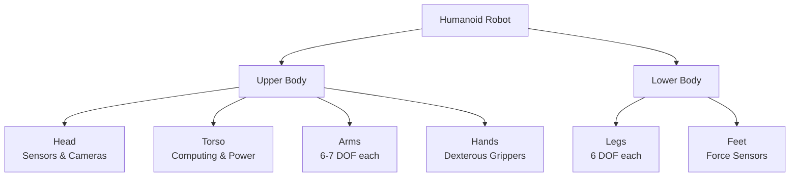
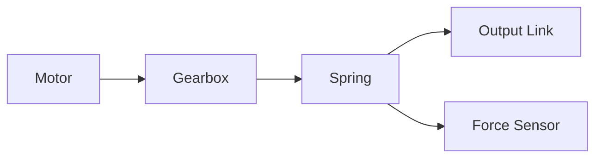
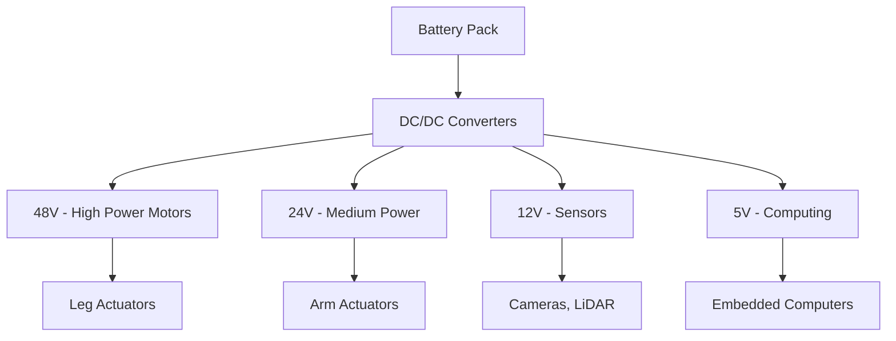

# Chapter 2: Humanoid Robot Hardware & Actuator Systems

## Learning Objectives

By the end of this chapter, you will:
- Understand the mechanical structure of humanoid robots
- Learn about different actuator technologies
- Explore sensor systems for perception and proprioception
- Analyze power and energy management systems

## Humanoid Robot Mechanical Structure

Humanoid robots are designed to mimic the human form factor, typically featuring:



### Degrees of Freedom (DOF)

A typical humanoid robot has approximately **30-40 DOF**:

| Body Part | DOF | Function |
|-----------|-----|----------|
| Head | 2-3 | Pan, tilt, (roll) |
| Each Arm | 6-7 | Shoulder (3), elbow (1-2), wrist (2-3) |
| Torso | 1-3 | Waist rotation, bending |
| Each Leg | 6 | Hip (3), knee (1), ankle (2) |
| Each Hand | 4-20 | Finger articulation |

## Actuator Technologies

### 1. Electric Motors

The most common actuator type in modern humanoid robots:

#### Brushless DC Motors (BLDC)

**Advantages**:
- High efficiency (85-90%)
- Precise control
- Low maintenance
- Long lifespan

**Disadvantages**:
- Requires complex control electronics
- Higher cost than brushed motors

**Example Specification** (typical arm joint):
```yaml
Motor: Maxon EC90
Power: 200W
Torque: 0.25 Nm (continuous)
Speed: 3000 RPM
Gear Ratio: 100:1
Output Torque: 25 Nm
Weight: 450g
```

#### Control Loop

```python
import numpy as np

class MotorController:
    """PID controller for electric motor"""

    def __init__(self, kp, ki, kd):
        self.kp = kp  # Proportional gain
        self.ki = ki  # Integral gain
        self.kd = kd  # Derivative gain
        self.prev_error = 0
        self.integral = 0

    def compute(self, target_position, current_position, dt):
        """
        Compute motor command using PID control

        Args:
            target_position: Desired position (radians)
            current_position: Current position (radians)
            dt: Time step (seconds)

        Returns:
            motor_command: Control signal
        """
        error = target_position - current_position

        # Proportional term
        p_term = self.kp * error

        # Integral term (with anti-windup)
        self.integral += error * dt
        self.integral = np.clip(self.integral, -10, 10)
        i_term = self.ki * self.integral

        # Derivative term
        d_term = self.kd * (error - self.prev_error) / dt

        # Update state
        self.prev_error = error

        # Compute command
        motor_command = p_term + i_term + d_term

        return np.clip(motor_command, -1.0, 1.0)


# Usage example
controller = MotorController(kp=5.0, ki=0.1, kd=0.5)

target_angle = np.pi / 4  # 45 degrees
current_angle = 0.0
dt = 0.01  # 10ms control loop

for step in range(100):
    command = controller.compute(target_angle, current_angle, dt)
    # Send command to motor driver
    # current_angle = read_encoder()
```

### 2. Hydraulic Actuators

Used in high-power applications (e.g., Boston Dynamics Atlas):

**Advantages**:
- Very high power-to-weight ratio
- High force output
- Natural compliance

**Disadvantages**:
- Requires hydraulic pump and fluid system
- Noisy operation
- Maintenance complexity
- Potential leaks

### 3. Pneumatic Actuators

Compressed air-based actuation:

**Advantages**:
- Inherently compliant (safe for human interaction)
- Simple and lightweight
- Low cost

**Disadvantages**:
- Lower precision
- Requires air compressor
- Limited force control

### 4. Series Elastic Actuators (SEA)

A spring element is placed between the motor and the load:



**Key Benefits**:
- Force control through spring deflection measurement
- Impact tolerance and safety
- Energy storage for efficient locomotion

**Example Implementation**:
```python
class SeriesElasticActuator:
    """Series Elastic Actuator model"""

    def __init__(self, spring_constant, max_deflection):
        self.k = spring_constant  # N/m
        self.max_deflection = max_deflection  # meters

    def compute_force(self, motor_position, output_position):
        """
        Compute force from spring deflection

        Args:
            motor_position: Position of motor side (meters)
            output_position: Position of output side (meters)

        Returns:
            force: Force transmitted through spring (Newtons)
        """
        deflection = motor_position - output_position

        # Clip deflection to prevent spring damage
        deflection = np.clip(deflection, -self.max_deflection, self.max_deflection)

        force = self.k * deflection
        return force

    def compute_motor_position_for_force(self, desired_force, output_position):
        """
        Compute required motor position for desired force

        Args:
            desired_force: Target force (Newtons)
            output_position: Current output position (meters)

        Returns:
            motor_position: Required motor position
        """
        required_deflection = desired_force / self.k
        motor_position = output_position + required_deflection
        return motor_position


# Usage
sea = SeriesElasticActuator(spring_constant=50000, max_deflection=0.01)

# To generate 100N force
desired_force = 100.0  # N
output_pos = 0.0  # m
motor_pos = sea.compute_motor_position_for_force(desired_force, output_pos)

print(f"Motor position: {motor_pos * 1000:.2f} mm")
print(f"Spring deflection: {motor_pos * 1000:.2f} mm")
print(f"Generated force: {sea.compute_force(motor_pos, output_pos):.1f} N")
```

## Sensor Systems

### Proprioceptive Sensors

Sensors that measure the robot's internal state:

#### 1. Encoders

Measure joint position and velocity:

```python
class QuadratureEncoder:
    """Simulate quadrature encoder for motor position"""

    def __init__(self, counts_per_revolution):
        self.cpr = counts_per_revolution
        self.count = 0
        self.prev_time = 0

    def get_position(self):
        """Get position in radians"""
        return (self.count / self.cpr) * 2 * np.pi

    def get_velocity(self, current_time):
        """Get velocity in radians/second"""
        if self.prev_time == 0:
            return 0.0

        dt = current_time - self.prev_time
        velocity = (self.get_position() / dt)
        self.prev_time = current_time
        return velocity

    def update_count(self, new_count):
        """Update encoder count from hardware"""
        self.count = new_count
```

#### 2. Inertial Measurement Unit (IMU)

Provides acceleration and angular velocity:

```python
import numpy as np

class IMUData:
    """IMU sensor data structure"""

    def __init__(self):
        self.acceleration = np.zeros(3)  # m/s^2 (x, y, z)
        self.angular_velocity = np.zeros(3)  # rad/s (roll, pitch, yaw)
        self.orientation = np.zeros(4)  # quaternion (w, x, y, z)

    def compute_orientation(self, dt):
        """
        Integrate angular velocity to estimate orientation
        (Simplified - real implementation uses sensor fusion)
        """
        # This is a simplified integration
        # Real systems use complementary or Kalman filters
        roll_rate, pitch_rate, yaw_rate = self.angular_velocity

        # Update orientation (very simplified)
        # In practice, use quaternion integration
        pass


# Example IMU data
imu = IMUData()
imu.acceleration = np.array([0.0, 0.0, 9.81])  # At rest, sensing gravity
imu.angular_velocity = np.array([0.0, 0.0, 0.0])  # No rotation
```

#### 3. Force/Torque Sensors

Measure interaction forces at joints or end-effectors:

```yaml
Sensor: ATI Mini40
Force Range:
  - Fx, Fy: ±40 N
  - Fz: ±120 N
Torque Range:
  - Tx, Ty, Tz: ±2 Nm
Resolution: 1/50 N, 1/1000 Nm
Sampling Rate: 7000 Hz
```

### Exteroceptive Sensors

Sensors that perceive the external environment:

#### Cameras

- **RGB Cameras**: Color perception, object recognition
- **Depth Cameras**: Intel RealSense, Azure Kinect
- **Stereo Cameras**: Depth from disparity

#### LiDAR

3D point cloud generation for mapping and obstacle detection:

```python
class LiDARPoint:
    """Single LiDAR point"""
    def __init__(self, x, y, z, intensity):
        self.x = x
        self.y = y
        self.z = z
        self.intensity = intensity


class LiDARScan:
    """Process LiDAR scan data"""

    def __init__(self):
        self.points = []

    def filter_by_distance(self, min_dist, max_dist):
        """Filter points by distance from sensor"""
        filtered = []
        for p in self.points:
            dist = np.sqrt(p.x**2 + p.y**2 + p.z**2)
            if min_dist <= dist <= max_dist:
                filtered.append(p)
        return filtered
```

## Power Systems

### Battery Technologies

Modern humanoid robots typically use:

**Lithium-Ion (Li-ion)**:
- Energy density: 150-250 Wh/kg
- Voltage: 3.6-3.7V per cell
- Cycle life: 500-1000 cycles

**Example Battery Pack**:
```yaml
Battery: Tesla 21700 cells (72 cells)
Configuration: 18S4P (18 series, 4 parallel)
Voltage: 64.8V nominal (75.6V max)
Capacity: 17.5 Ah
Energy: 1.13 kWh
Weight: 7 kg
Runtime: 2-3 hours (typical operation)
```

### Power Distribution



## Case Study: Tesla Optimus

Let's analyze the hardware specifications of Tesla's Optimus Gen 2:

| Specification | Value |
|--------------|-------|
| Height | 5'8" (173 cm) |
| Weight | 121 lbs (55 kg) |
| DOF | 28 |
| Hand DOF | 11 per hand |
| Walking Speed | 5 mph (8 km/h) |
| Payload | 45 lbs (20 kg) |
| Battery | ~2.3 kWh |
| Runtime | 2-4 hours |
| Actuators | Custom brushless motors with harmonic drives |

### Key Innovations

1. **Custom Actuators**: Integrated motor, driver, and encoder in compact package
2. **Hands**: 11 DOF with tactile sensing for dexterous manipulation
3. **Foot Design**: Large contact area with force sensors for stable walking
4. **Wireless Charging**: Inductive charging for autonomous operation

## Summary

In this chapter, we've explored the physical hardware that enables humanoid robots to move and interact with their environment. We covered:

- Mechanical structure and degrees of freedom
- Various actuator technologies (electric, hydraulic, pneumatic, SEA)
- Sensor systems for perception and proprioception
- Power and energy management

Understanding these hardware fundamentals is crucial for developing effective control algorithms and intelligent behaviors.

## Exercises

1. **Design Exercise**: Specify the actuators needed for a 7-DOF robotic arm capable of lifting 5 kg
2. **Coding**: Implement a complementary filter to fuse accelerometer and gyroscope data
3. **Analysis**: Compare the power consumption of different actuation technologies for a knee joint
4. **Research**: Investigate recent advances in artificial muscles (e.g., McKibben actuators)

---

**Next**: [Chapter 3: Sensor Fusion & Perception](./chapter-3-sensors.md)
