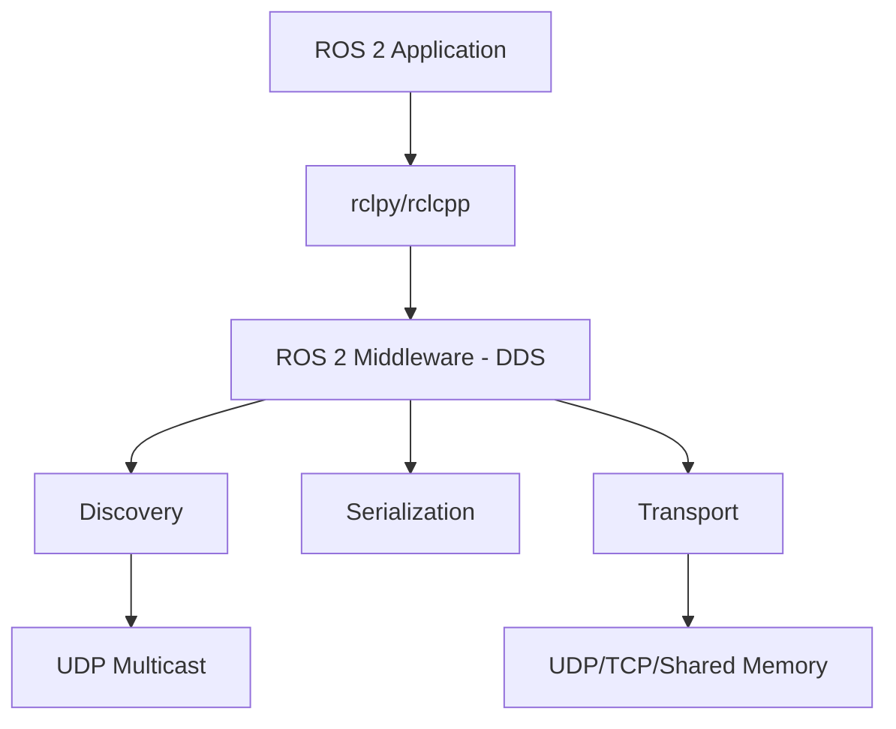
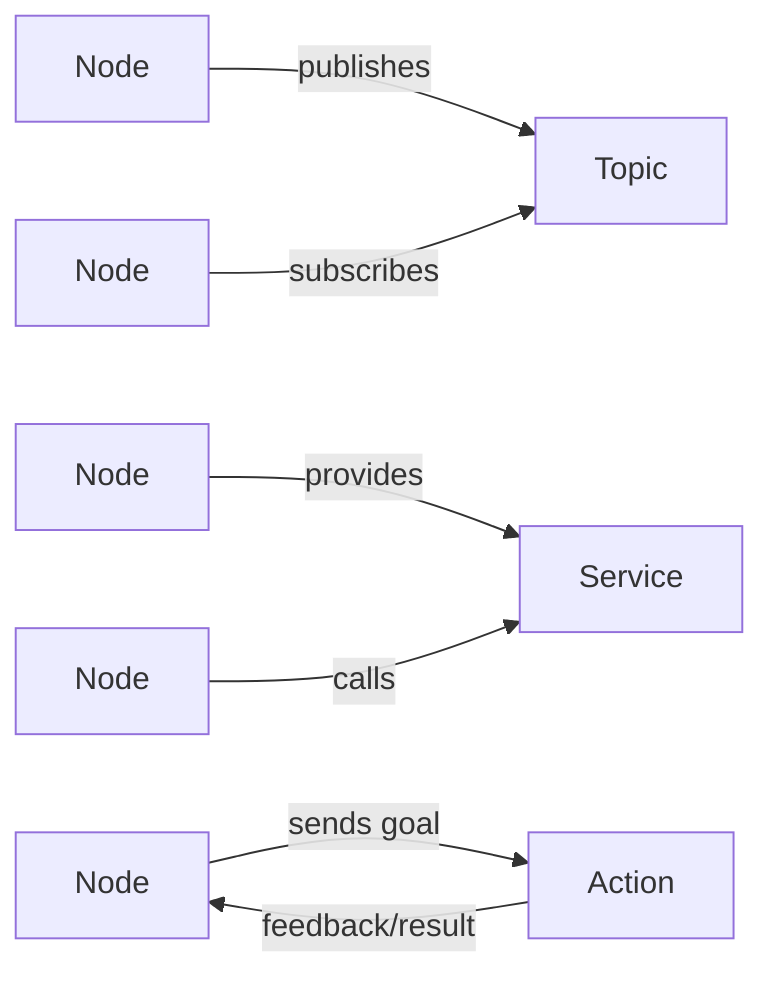

# Chapter 5: Introduction to ROS 2

## Learning Objectives

By the end of this chapter, you will:
- Understand the ROS 2 architecture and key concepts
- Set up a ROS 2 development environment
- Create and run your first ROS 2 nodes
- Understand topics, services, and actions
- Build a simple publisher-subscriber system

## What is ROS 2?

**Robot Operating System 2 (ROS 2)** is the next generation of ROS, designed for production robotics systems. It provides:

- **Middleware**: Communication between distributed components
- **Tools**: Debugging, visualization, simulation integration
- **Libraries**: Perception, planning, control algorithms
- **Ecosystem**: Thousands of community packages



### Why ROS 2 over ROS 1?

| Feature | ROS 1 | ROS 2 |
|---------|-------|-------|
| Architecture | Master-based (single point of failure) | Distributed (no master) |
| Real-time | Limited support | Real-time capable |
| Security | No built-in security | DDS security |
| Multi-robot | Complex | Native support |
| Communication | TCP-based | DDS (multiple QoS profiles) |
| Platforms | Mainly Linux | Linux, Windows, macOS |
| Production | Research-focused | Production-ready |

## ROS 2 Architecture

### Core Concepts



#### 1. Nodes

Self-contained processes that perform specific tasks:

```python
import rclpy
from rclpy.node import Node

class MinimalNode(Node):
    """Simplest ROS 2 node"""

    def __init__(self):
        super().__init__('minimal_node')
        self.get_logger().info('Minimal node has been started')

def main(args=None):
    rclpy.init(args=args)
    node = MinimalNode()
    rclpy.spin(node)
    node.destroy_node()
    rclpy.shutdown()

if __name__ == '__main__':
    main()
```

#### 2. Topics

Asynchronous, streaming communication:

```python
from rclpy.node import Node
from std_msgs.msg import String

class PublisherNode(Node):
    """Node that publishes to a topic"""

    def __init__(self):
        super().__init__('publisher_node')

        # Create publisher
        self.publisher = self.create_publisher(String, 'my_topic', 10)

        # Create timer for periodic publishing
        self.timer = self.create_timer(1.0, self.timer_callback)
        self.counter = 0

    def timer_callback(self):
        """Called every second"""
        msg = String()
        msg.data = f'Hello ROS 2: {self.counter}'
        self.publisher.publish(msg)
        self.get_logger().info(f'Publishing: "{msg.data}"')
        self.counter += 1
```

```python
class SubscriberNode(Node):
    """Node that subscribes to a topic"""

    def __init__(self):
        super().__init__('subscriber_node')

        # Create subscriber
        self.subscription = self.create_subscription(
            String,
            'my_topic',
            self.listener_callback,
            10
        )

    def listener_callback(self, msg):
        """Called when message received"""
        self.get_logger().info(f'Received: "{msg.data}"')
```

#### 3. Services

Synchronous request-response communication:

```python
from example_interfaces.srv import AddTwoInts

class ServiceServer(Node):
    """Node that provides a service"""

    def __init__(self):
        super().__init__('service_server')

        self.srv = self.create_service(
            AddTwoInts,
            'add_two_ints',
            self.add_two_ints_callback
        )

    def add_two_ints_callback(self, request, response):
        """Handle service request"""
        response.sum = request.a + request.b
        self.get_logger().info(f'{request.a} + {request.b} = {response.sum}')
        return response
```

```python
class ServiceClient(Node):
    """Node that calls a service"""

    def __init__(self):
        super().__init__('service_client')

        self.client = self.create_client(AddTwoInts, 'add_two_ints')

        # Wait for service to be available
        while not self.client.wait_for_service(timeout_sec=1.0):
            self.get_logger().info('Service not available, waiting...')

    def send_request(self, a, b):
        """Send service request"""
        request = AddTwoInts.Request()
        request.a = a
        request.b = b

        future = self.client.call_async(request)
        return future
```

#### 4. Actions

Long-running tasks with feedback:

```python
from action_tutorials_interfaces.action import Fibonacci
from rclpy.action import ActionServer

class FibonacciActionServer(Node):
    """Action server for computing Fibonacci sequence"""

    def __init__(self):
        super().__init__('fibonacci_action_server')

        self._action_server = ActionServer(
            self,
            Fibonacci,
            'fibonacci',
            self.execute_callback
        )

    def execute_callback(self, goal_handle):
        """Execute action"""
        self.get_logger().info('Executing goal...')

        # Get goal
        order = goal_handle.request.order

        # Initialize feedback
        feedback_msg = Fibonacci.Feedback()
        feedback_msg.sequence = [0, 1]

        # Compute Fibonacci sequence
        for i in range(1, order):
            if goal_handle.is_cancel_requested:
                goal_handle.canceled()
                return Fibonacci.Result()

            # Compute next number
            feedback_msg.sequence.append(
                feedback_msg.sequence[i] + feedback_msg.sequence[i-1]
            )

            # Publish feedback
            goal_handle.publish_feedback(feedback_msg)

            # Sleep to simulate work
            time.sleep(0.5)

        # Mark goal as succeeded
        goal_handle.succeed()

        # Return result
        result = Fibonacci.Result()
        result.sequence = feedback_msg.sequence
        return result
```

## Quality of Service (QoS)

ROS 2 provides configurable QoS profiles for reliable communication:

```python
from rclpy.qos import QoSProfile, ReliabilityPolicy, HistoryPolicy

class RobustPublisher(Node):
    """Publisher with custom QoS settings"""

    def __init__(self):
        super().__init__('robust_publisher')

        # Define QoS profile
        qos_profile = QoSProfile(
            reliability=ReliabilityPolicy.RELIABLE,  # Guaranteed delivery
            history=HistoryPolicy.KEEP_LAST,
            depth=10
        )

        # Create publisher with custom QoS
        self.publisher = self.create_publisher(
            String,
            'critical_topic',
            qos_profile
        )
```

### Common QoS Profiles

```python
from rclpy.qos import qos_profile_sensor_data, qos_profile_system_default

# For sensor data (best effort, volatile)
sensor_pub = self.create_publisher(
    LaserScan,
    'scan',
    qos_profile_sensor_data
)

# For command/control (reliable, keep last 10)
cmd_pub = self.create_publisher(
    Twist,
    'cmd_vel',
    qos_profile_system_default
)
```

## ROS 2 Package Structure

A typical ROS 2 Python package:

```
my_robot_pkg/
├── package.xml          # Package manifest
├── setup.py             # Python setup file
├── setup.cfg            # Setup configuration
├── resource/            # Package marker
│   └── my_robot_pkg
├── my_robot_pkg/        # Python module
│   ├── __init__.py
│   ├── node_a.py        # Node implementations
│   └── node_b.py
└── test/                # Unit tests
    ├── test_node_a.py
    └── test_node_b.py
```

### Creating a Package

```bash
# Navigate to workspace src directory
cd ~/ros2_ws/src

# Create package
ros2 pkg create --build-type ament_python my_robot_pkg \
  --dependencies rclpy std_msgs geometry_msgs

# Build package
cd ~/ros2_ws
colcon build --packages-select my_robot_pkg

# Source workspace
source install/setup.bash

# Run node
ros2 run my_robot_pkg my_node
```

## Launch Files

Launch multiple nodes with configuration:

```python
from launch import LaunchDescription
from launch_ros.actions import Node

def generate_launch_description():
    """Launch file for robot system"""

    return LaunchDescription([
        # Camera node
        Node(
            package='usb_cam',
            executable='usb_cam_node',
            name='camera',
            parameters=[{
                'video_device': '/dev/video0',
                'framerate': 30.0,
                'image_width': 640,
                'image_height': 480
            }]
        ),

        # Object detection node
        Node(
            package='object_detection',
            executable='detector_node',
            name='detector',
            remappings=[
                ('image', '/camera/image_raw'),
                ('detections', '/objects')
            ]
        ),

        # Robot controller
        Node(
            package='robot_control',
            executable='controller_node',
            name='controller',
            parameters=[{'max_speed': 1.0}]
        )
    ])
```

Run launch file:
```bash
ros2 launch my_robot_pkg robot_launch.py
```

## Command Line Tools

Essential ROS 2 CLI commands:

```bash
# List nodes
ros2 node list

# Get node info
ros2 node info /my_node

# List topics
ros2 topic list

# Echo topic messages
ros2 topic echo /my_topic

# Publish to topic
ros2 topic pub /cmd_vel geometry_msgs/msg/Twist \
  "{linear: {x: 0.5}, angular: {z: 0.0}}"

# List services
ros2 service list

# Call service
ros2 service call /add_two_ints example_interfaces/srv/AddTwoInts \
  "{a: 2, b: 3}"

# View computational graph
rqt_graph

# Plot topic data
ros2 run rqt_plot rqt_plot /topic_name
```

## Practical Example: Robot Velocity Controller

```python
import rclpy
from rclpy.node import Node
from geometry_msgs.msg import Twist
from sensor_msgs.msg import LaserScan
import numpy as np

class ObstacleAvoidance(Node):
    """
    Simple obstacle avoidance using laser scan
    """

    def __init__(self):
        super().__init__('obstacle_avoidance')

        # Publisher for velocity commands
        self.cmd_vel_pub = self.create_publisher(Twist, 'cmd_vel', 10)

        # Subscriber for laser scan
        self.scan_sub = self.create_subscription(
            LaserScan,
            'scan',
            self.scan_callback,
            qos_profile_sensor_data
        )

        # Parameters
        self.declare_parameter('safe_distance', 0.5)
        self.declare_parameter('max_linear_speed', 0.5)
        self.declare_parameter('max_angular_speed', 1.0)

    def scan_callback(self, msg):
        """Process laser scan and publish velocity"""

        # Get minimum distance
        ranges = np.array(msg.ranges)
        ranges[ranges == 0] = np.inf  # Ignore invalid readings
        min_distance = np.min(ranges)

        # Get parameters
        safe_dist = self.get_parameter('safe_distance').value
        max_linear = self.get_parameter('max_linear_speed').value
        max_angular = self.get_parameter('max_angular_speed').value

        # Create velocity command
        cmd = Twist()

        if min_distance < safe_dist:
            # Too close - turn away
            self.get_logger().warn(f'Obstacle detected at {min_distance:.2f}m')

            cmd.linear.x = 0.0
            cmd.angular.z = max_angular  # Turn left

        else:
            # Safe to move forward
            # Speed proportional to distance
            speed_factor = min(1.0, (min_distance - safe_dist) / safe_dist)
            cmd.linear.x = max_linear * speed_factor
            cmd.angular.z = 0.0

        # Publish command
        self.cmd_vel_pub.publish(cmd)


def main(args=None):
    rclpy.init(args=args)
    node = ObstacleAvoidance()
    rclpy.spin(node)
    node.destroy_node()
    rclpy.shutdown()
```

## Debugging Tips

### 1. Check Node Status

```bash
# Is node running?
ros2 node list

# Check node connections
ros2 node info /my_node
```

### 2. Monitor Topics

```bash
# Check topic frequency
ros2 topic hz /my_topic

# Check topic bandwidth
ros2 topic bw /my_topic

# View message type
ros2 topic type /my_topic
```

### 3. Logging

```python
# Different log levels
self.get_logger().debug('Detailed info')
self.get_logger().info('Normal operation')
self.get_logger().warn('Warning condition')
self.get_logger().error('Error occurred')
self.get_logger().fatal('Critical failure')
```

View logs:
```bash
ros2 run rqt_console rqt_console
```

## Summary

ROS 2 provides a powerful framework for building robotic systems:

- **Distributed architecture** with no single point of failure
- **Flexible communication** via topics, services, and actions
- **Quality of Service** for reliable, real-time systems
- **Rich ecosystem** of tools and libraries

In the next chapter, we'll explore **URDF robot modeling** to describe our humanoid robot's structure.

## Exercises

1. **Publisher-Subscriber**: Create a temperature sensor node that publishes data and a monitor node that subscribes
2. **Service**: Implement a "change robot mode" service (autonomous/manual/emergency)
3. **Action**: Create a "move to goal" action server with progress feedback
4. **Launch File**: Write a launch file that starts all three nodes from exercises 1-3

## Further Reading

- [ROS 2 Documentation](https://docs.ros.org/en/humble/)
- [ROS 2 Design](https://design.ros2.org/)
- [DDS: The Middleware Protocol](https://www.dds-foundation.org/)
- [ROS 2 Tutorials](https://docs.ros.org/en/humble/Tutorials.html)

---

**Next**: [Chapter 6: URDF Robot Modeling](./chapter-6-urdf.md)
