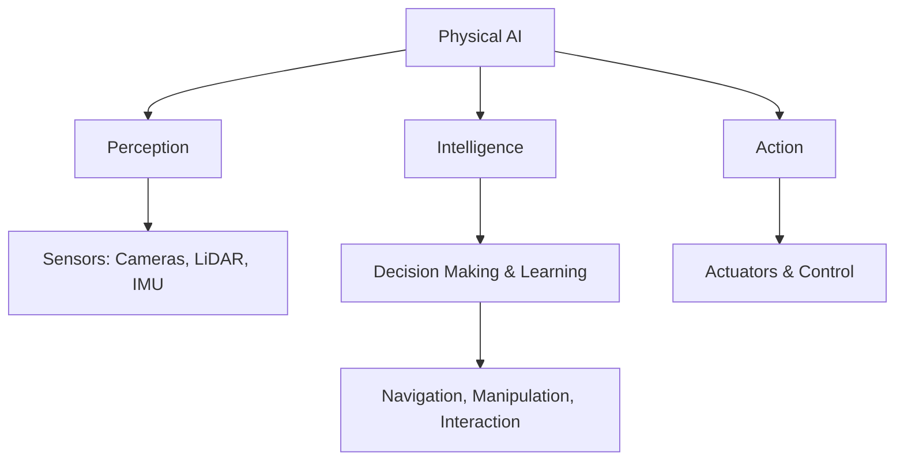

# Chapter 1: Introduction to Physical AI

## Learning Objectives

By the end of this chapter, you will be able to:
- Define Physical AI and explain its significance
- Understand the evolution from traditional robotics to Physical AI
- Identify key components of Physical AI systems
- Recognize real-world applications and use cases

## What is Physical AI?

**Physical AI** refers to artificial intelligence systems that can perceive, understand, and interact with the physical world. Unlike traditional AI that operates purely in digital environments, Physical AI bridges the gap between computation and physical action.



### Key Characteristics

1. **Embodied Intelligence**: Physical AI systems have a physical form that allows them to interact with the world
2. **Sensor Fusion**: Integration of multiple sensor modalities (vision, touch, proprioception)
3. **Real-time Processing**: Ability to make decisions and act in real-time
4. **Adaptive Learning**: Continuous improvement through experience and feedback

## Evolution of Physical AI

The journey to modern Physical AI has been decades in the making:

### Timeline

| Era | Technology | Key Characteristics |
|-----|-----------|---------------------|
| 1960s-1980s | Industrial Robots | Fixed, repetitive tasks in controlled environments |
| 1990s-2000s | Mobile Robots | Navigation in structured environments (e.g., warehouse robots) |
| 2010s | Service Robots | Human interaction, unstructured environments |
| 2020s+ | **Physical AI** | Multimodal learning, generalist capabilities, human-level dexterity |

### From Traditional Robotics to Physical AI

```python
# Traditional Robotics Approach
def pick_object():
    move_to_position([x, y, z])  # Pre-programmed positions
    close_gripper()
    return "success"

# Physical AI Approach
def pick_object(image, depth_map):
    # Perceive the environment
    object_pose = vision_model.detect(image, depth_map)

    # Plan grasp strategy
    grasp_type = grasp_planner.plan(object_pose, object_properties)

    # Execute with feedback
    trajectory = motion_planner.generate_trajectory(current_pose, object_pose)
    success = execute_with_force_feedback(trajectory, grasp_type)

    # Learn from experience
    if not success:
        update_model(image, depth_map, failure_reason)

    return success
```

## Core Components of Physical AI Systems

### 1. Perception System

The perception system allows robots to understand their environment:

- **Computer Vision**: Object detection, segmentation, pose estimation
- **Depth Sensing**: LiDAR, stereo cameras, time-of-flight sensors
- **Tactile Sensing**: Force/torque sensors, tactile arrays
- **Proprioception**: Joint encoders, IMUs for self-awareness

### 2. Intelligence Layer

The brain of the Physical AI system:

- **World Models**: Understanding physics, object properties, dynamics
- **Planning Algorithms**: Path planning, motion planning, task planning
- **Learning Systems**: Reinforcement learning, imitation learning, transfer learning
- **Large Models**: Vision-Language-Action (VLA) models for generalist capabilities

### 3. Action System

Executing decisions in the physical world:

- **Actuators**: Motors, hydraulics, pneumatics
- **Control Systems**: PID, MPC, impedance control
- **Safety Systems**: Collision detection, force limiting, emergency stops

## Real-World Applications

### Humanoid Robots

Humanoid robots represent the pinnacle of Physical AI, designed to navigate human environments:

- **Tesla Optimus**: General-purpose humanoid for manufacturing and household tasks
- **Figure 01**: Warehouse automation and logistics
- **Boston Dynamics Atlas**: Research platform for dynamic locomotion

### Industrial Automation

- **Bin picking**: Random object grasping with vision guidance
- **Quality inspection**: Automated visual inspection with AI
- **Collaborative robots (cobots)**: Safe human-robot collaboration

### Healthcare

- **Surgical robots**: Da Vinci system for minimally invasive surgery
- **Rehabilitation robots**: Exoskeletons for mobility assistance
- **Care robots**: Eldercare and patient monitoring

### Autonomous Systems

- **Self-driving vehicles**: Waymo, Tesla FSD
- **Drones**: Package delivery, inspection, agriculture
- **Warehouse robots**: Amazon fulfillment centers

## Technical Challenges

Despite significant progress, Physical AI faces several challenges:

1. **Sim-to-Real Gap**: Models trained in simulation often fail in real-world conditions
2. **Safety and Reliability**: Ensuring safe operation around humans
3. **Generalization**: Creating systems that work in diverse, unstructured environments
4. **Data Efficiency**: Learning complex behaviors with limited real-world data
5. **Computational Constraints**: Real-time processing on limited hardware

## The Role of ROS 2

**Robot Operating System 2 (ROS 2)** has become the de facto standard for developing Physical AI systems. It provides:

- Modular architecture for component integration
- Communication middleware for distributed systems
- Extensive libraries for perception, planning, and control
- Simulation tools (Gazebo, Isaac Sim) for development

Throughout this course, we'll use ROS 2 as our primary development framework.

## Looking Ahead

The future of Physical AI is incredibly exciting:

- **Generalist robots**: Single models capable of diverse tasks
- **Natural language control**: Commanding robots with human language
- **Transfer learning**: Rapid adaptation to new tasks and environments
- **Human-robot collaboration**: Seamless teamwork between humans and robots

## Summary

In this chapter, we've introduced Physical AI as the next evolution of robotics, combining perception, intelligence, and action to create systems that can navigate and interact with the real world. We've explored the key components, applications, and challenges facing this field.

In the next chapter, we'll dive deeper into **humanoid robot hardware and actuator systems**, exploring how these sophisticated machines are built and controlled.

## Further Reading

- [Physical Intelligence: The Forgotten Half of AI](https://arxiv.org/abs/2303.03320)
- [A Brief History of Robotics](https://www.robotics.org/joseph-engelberger/history-of-robotics.cfm)
- [ROS 2 Documentation](https://docs.ros.org/en/humble/)

## Exercises

1. **Reflection**: Write a short paragraph describing a Physical AI application you'd like to build
2. **Research**: Find three recent papers on Physical AI or embodied AI (arxiv.org)
3. **Comparison**: Create a table comparing two humanoid robots (e.g., Optimus vs Atlas)
4. **Mermaid Practice**: Draw a system architecture diagram for a simple pick-and-place robot

---

**Next**: [Chapter 2: Humanoid Robot Hardware & Actuators](./chapter-2-hardware.md)
